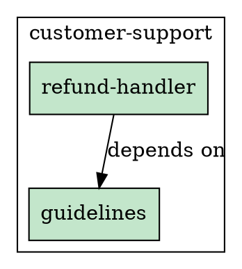

# End-to-End Example

This guide walks through a complete workflow using prompt-vc to manage prompts for a customer support system.

## Scenario

You're building a customer support chatbot that handles refund requests. You need to:
- Create prompts with proper metadata
- Track why specific text exists (annotations)
- Ensure prompts meet governance requirements before production
- Compose prompts from reusable components

## Step 1: Initialize the Repository

```bash
# Create a new directory for your prompts
mkdir my-prompts && cd my-prompts

# Initialize prompt-vc with a manifest file
prompt-vc init --with-manifest
```

This creates:
```
my-prompts/
├── prompts.manifest.yaml
└── .prompt-vc/
```

## Step 2: Configure the Manifest

Edit `prompts.manifest.yaml` to define your domains and governance rules:

```yaml
schema_version: "1.0"
organization: acme-corp
repository: support-prompts

defaults:
  model: claude-sonnet-4-20250514
  template_engine: jinja2

domains:
  customer-support:
    description: Customer-facing support automation
    owners:
      - team: support-engineering
        slack: "#support-eng"
    prompts: []

governance:
  production_requirements:
    must_have_intent: true
    must_have_evaluation: false
    min_annotations: 1
    required_tags: [reviewed]
```

## Step 3: Create Your First Prompt

```bash
# Create a shared guidelines prompt
prompt-vc new guidelines --domain customer-support --format md
```

This creates two files:
- `customer-support/guidelines.prompt.md` - Your prompt content
- `customer-support/guidelines.prompt.meta.yaml` - Metadata

Edit `customer-support/guidelines.prompt.md`:

```markdown
# Customer Support Guidelines

## Tone and Style
- Be professional and empathetic
- Use clear, simple language
- Acknowledge customer concerns before providing solutions

## Compliance Rules
You MUST NOT:
- Share customer personal data with third parties
- Make promises about future product features
- Provide legal or financial advice

## Response Format
1. Greet the customer by name if available
2. Acknowledge their issue
3. Provide clear next steps
4. Offer additional assistance
```

Edit `customer-support/guidelines.prompt.meta.yaml`:

```yaml
schema_version: "1.0"
id: guidelines
name: Customer Support Guidelines
intent: |
  Provide consistent guidelines for all customer support interactions,
  ensuring compliance with company policies and maintaining a professional tone.

assumptions:
  model: claude-sonnet-4-20250514
  max_tokens: 500
```

## Step 4: Add Annotations

Annotations explain *why* specific text exists. Add an annotation for the compliance rules:

```bash
prompt-vc annotate guidelines --line 9 \
  --rationale "GDPR and privacy law compliance - critical for EU customers" \
  --source "https://legal.acme-corp.com/privacy-policy" \
  --tags legal,privacy,gdpr,reviewed \
  --author "legal@acme-corp.com"
```

This adds the annotation to your meta file. View it:

```bash
prompt-vc view guidelines --annotated
```

Output:
```
# Customer Support Guidelines
...
8│ You MUST NOT:
9│ - Share customer personal data with third parties  ← [ann_01] GDPR compliance
10│ - Make promises about future product features
...
```

## Step 5: Create a Dependent Prompt

Create a refund handler that includes the shared guidelines:

```bash
prompt-vc new refund-handler --domain customer-support --format md
```

Edit `customer-support/refund-handler.prompt.md`:

```markdown
You are a customer support agent for {{company_name}}.

Your role is to help customers with refund requests. Be empathetic but follow policy.

{# @include guidelines #}

## Refund-Specific Guidelines

When reviewing a refund request:
1. Verify the order exists and belongs to this customer
2. Check if the order is within the refund window ({{refund_window_days}} days)
3. Confirm the refund amount doesn't exceed {{max_refund_amount}}

You MUST NOT promise refunds exceeding {{max_refund_amount}} without manager approval.

## Response Format

Respond with JSON:
```json
{
  "decision": "approve" | "deny" | "escalate",
  "reasoning": "Brief explanation",
  "refund_amount": number | null
}
```

## Current Request

Customer: {{customer_name}}
Order ID: {{order_id}}
Order Total: {{order_total}}
```

Edit the meta file `customer-support/refund-handler.prompt.meta.yaml`:

```yaml
schema_version: "1.0"
id: refund-handler
name: Refund Request Handler
intent: |
  Process customer refund requests with appropriate limits,
  balancing customer satisfaction with company policy compliance.

assumptions:
  model: claude-sonnet-4-20250514
  max_tokens: 1000
  template_engine: jinja2

variables:
  company_name:
    type: string
    required: true
    description: Company name for the greeting
  refund_window_days:
    type: integer
    default: 30
    description: Number of days within which refunds are allowed
  max_refund_amount:
    type: string
    default: "$100"
    description: Maximum refund amount without manager approval
  customer_name:
    type: string
    required: true
  order_id:
    type: string
    required: true
  order_total:
    type: string
    required: true
```

Add an annotation for the refund limit:

```bash
prompt-vc annotate refund-handler --line 14 \
  --rationale "Legal requirement - manager approval for large refunds per company policy" \
  --source "https://policy.acme-corp.com/refunds" \
  --tags safety,legal,reviewed
```

## Step 6: Update the Manifest

Add the prompts and their relationship to `prompts.manifest.yaml`:

```yaml
domains:
  customer-support:
    description: Customer-facing support automation
    owners:
      - team: support-engineering
        slack: "#support-eng"
    prompts:
      - id: guidelines
        path: customer-support/guidelines.prompt.md
        status: production
        deployed_to: [support-api, chat-widget]
      - id: refund-handler
        path: customer-support/refund-handler.prompt.md
        status: production
        deployed_to: [support-api]

relationships:
  - type: depends_on
    from: refund-handler
    to: guidelines
    note: "Includes shared customer support guidelines"
```

## Step 7: Validate Your Prompts

Check that everything is configured correctly:

```bash
prompt-vc validate
```

Output:
```
Validating prompts...

✓ customer-support/guidelines.prompt.md
  Meta: valid
  Annotations: 1 valid

✓ customer-support/refund-handler.prompt.md
  Meta: valid
  Annotations: 1 valid

2 prompts validated, 0 errors, 0 warnings
```

## Step 8: Run Governance Audit

Check if prompts meet production requirements:

```bash
prompt-vc audit --status production
```

Output:
```
Audit Report
============

Production Requirements:
  - must_have_intent: true
  - min_annotations: 1
  - required_tags: [reviewed]

Results:

✓ guidelines (customer-support)
  Status: production
  Compliant: Yes

✓ refund-handler (customer-support)
  Status: production
  Compliant: Yes

Summary: 2/2 production prompts compliant
```

## Step 9: View Prompt Information

Get detailed information about a prompt:

```bash
prompt-vc info refund-handler
```

Output:
```
Prompt: refund-handler
======================

Name: Refund Request Handler
Domain: customer-support
Status: production
Deployed to: support-api

Intent:
  Process customer refund requests with appropriate limits,
  balancing customer satisfaction with company policy compliance.

Variables:
  - company_name (string, required)
  - refund_window_days (integer, default: 30)
  - max_refund_amount (string, default: "$100")
  - customer_name (string, required)
  - order_id (string, required)
  - order_total (string, required)

Annotations: 1
  - ann_01: Legal requirement - manager approval (line 14)
    Tags: safety, legal, reviewed

Dependencies:
  - guidelines (via @include)
```

## Step 10: Render the Prompt

Render the prompt with actual values:

```bash
prompt-vc render refund-handler \
  -v company_name="Acme Corp" \
  -v customer_name="John Smith" \
  -v order_id="ORD-12345" \
  -v order_total="$75.00"
```

Or use a context file:

```bash
# Create context.json
cat > context.json << 'EOF'
{
  "company_name": "Acme Corp",
  "customer_name": "John Smith",
  "order_id": "ORD-12345",
  "order_total": "$75.00"
}
EOF

prompt-vc render refund-handler --context context.json
```

## Step 11: Compose with Includes

Resolve all includes to see the final composed prompt:

```bash
prompt-vc compose refund-handler
```

This outputs the full prompt with `{# @include guidelines #}` replaced by the actual guidelines content.

Show dependencies:

```bash
prompt-vc compose refund-handler --show-deps
```

Output:
```
Dependencies:
  refund-handler
    └── guidelines

Composed prompt:
================
You are a customer support agent for {{company_name}}.
...
# Customer Support Guidelines
## Tone and Style
...
```

## Step 12: Visualize Dependencies

Generate a dependency graph:

```bash
# Output DOT format to terminal
prompt-vc graph

# Save as PNG (requires graphviz)
prompt-vc graph --output deps.png --format png

# Save as SVG
prompt-vc graph --output deps.svg --format svg
```

Example DOT output:


## Step 13: Compare Versions

After making changes, compare with previous versions:

```bash
# Compare with previous commit
prompt-vc diff refund-handler --old HEAD~1

# Compare specific commits
prompt-vc diff refund-handler --old abc123 --new def456
```

## Step 14: Fix Stale Annotations

If prompt content changes and annotations become stale:

```bash
# Check for issues
prompt-vc validate

# Fix automatically (updates line hints)
prompt-vc fix-annotations refund-handler

# Or run in dry-run mode first
prompt-vc fix-annotations refund-handler --dry-run
```

## Step 15: List All Prompts

```bash
# List all prompts
prompt-vc list

# Filter by domain
prompt-vc list --domain customer-support

# Filter by status
prompt-vc list --status production

# Show paths
prompt-vc list --path
```

## Complete File Structure

After following this guide, your repository looks like:

```
my-prompts/
├── prompts.manifest.yaml
├── customer-support/
│   ├── guidelines.prompt.md
│   ├── guidelines.prompt.meta.yaml
│   ├── refund-handler.prompt.md
│   └── refund-handler.prompt.meta.yaml
└── context.json (optional)
```

## Summary

This example demonstrated:

| Feature | Command |
|---------|---------|
| Initialize | `prompt-vc init --with-manifest` |
| Create prompt | `prompt-vc new <id> --domain <domain>` |
| Add annotation | `prompt-vc annotate <id> --line <n>` |
| Validate | `prompt-vc validate` |
| Audit compliance | `prompt-vc audit --status production` |
| View prompt | `prompt-vc view <id> --annotated` |
| Get info | `prompt-vc info <id>` |
| Render template | `prompt-vc render <id> -v key=value` |
| Compose includes | `prompt-vc compose <id>` |
| Dependency graph | `prompt-vc graph --output graph.png` |
| Compare versions | `prompt-vc diff <id> --old HEAD~1` |
| Fix annotations | `prompt-vc fix-annotations <id>` |
| List prompts | `prompt-vc list --domain <domain>` |

For more details, see:
- [CLI Reference](cli.md)
- [Meta Schema](meta-schema.md)
- [Manifest Schema](manifest-schema.md)
- [Best Practices](best-practices.md)
